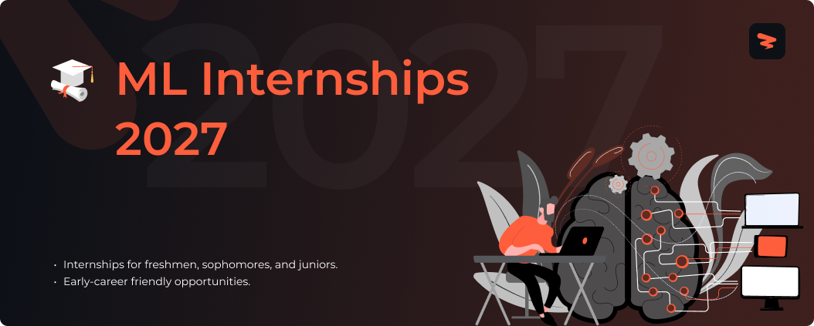

<!-- Cover -->

# AI & Machine Learning Internships 2027

🚀 Live AI, machine learning, and data science internships for students, refreshed through the Zapply job pipeline.

> [!TIP]
> Roles are sourced from active company postings. Always confirm eligibility, deadlines, and application details on the employer's official career page.
---

## **Website & Autofill Extension**

Explore Zapply's website and check out:

- Our Chrome extension, which autofills job applications in seconds.
- A dedicated job board featuring the latest openings across various roles.
- User accounts with multiple profiles for different resume types and roles.
- Job application tracking with streaks and commitment awards.

Experience an advanced career journey with us! 🚀

  

## Explore Around

Connect and seek advice from a growing network of fellow students and new grads.

  
  &nbsp;&nbsp;
  

---

 

<h3>🤖 <strong>Machine Learning & AI Engineering</strong></h3>

| Company | Role | Location | Posted | Visa | **Apply** |
|---------|------|----------|--------|------|----------|
| **Persona AI** | Machine Learning Internship, Manipula... | Houston, TX | 34m |  |  |
| **Human Computer Lab** | Intern - Software/ML Engineer | San Francisco | 34m |  |  |
| **Institute for Foundation Models** | AI Research Internship - LLM | Sunnyvale, CA | 34m |  |  |
| **Applied Intuition** | Research Intern - Reinforcement Learn... | Sunnyvale | 34m | 🏛 H-1B Co. |  |
| **Applied Intuition** | Research Intern - Reinforcement Learn... | Sunnyvale | 34m | 🏛 H-1B Co. |  |
| **Applied Intuition** | Research Intern - World-Action Founda... | Sunnyvale | 34m | 🏛 H-1B Co. |  |
| **ByteDance** | AI/LLM Network Research Intern (High ... | San Jose, California | 38m | 🏛 H-1B Co. |  |
| **ByteDance** | Machine Learning Engineer Intern (E-C... | Seattle, Washington | 38m | 🏛 H-1B Co. |  |
| **ByteDance** | Research Scientist Intern (Multimedia... | San Diego, California | 38m | 🏛 H-1B Co. |  |
| **Analog Devices** | AI/ML Engineer Intern | US, MA, Wilmington | 2d | 🏛 H-1B Co. |  |
| **Philips** | Intern – Data AI/ML Engineering – Ply... | Plymouth, Minnesota, U... | 2d | 🏛 H-1B Co. |  |
| **Workiva** | Summer 2027 Intern - Machine Learning... | Remote | 3d | 🏛 H-1B Co. |  |
| **Motorola Solutions** | Supply Chain Applied AI Engineering I... | Chicago, IL, More... | 3d | 🏛 H-1B Co. |  |
| **Honeywell** | Artificial Intelligence/Machine Learn... | United States | 5d | 🏛 H-1B Co. |  |
| **Kodiak Robotics** | Winter 2027 Intern, Artificial Intell... | Mountain View, CA | 5d | 🏛 H-1B Co. |  |
| **Intuitive** | Computer Vision Engineering Intern - ... | Sunnyvale, CA | 6d | 🏛 H-1B Co. |  |
| **Wex** | PhD Intern, AI/ML/NLP Engineer | Remote | 6d | 🏛 H-1B Co. |  |
| **Audax Group** | AI Engineer Co-Op | Boston, MA | 6d |  |  |
| **AMD** | 2027 Undergrad Machine Learning (ML)/... | Austin, TX, United States | 1w | 🏛 H-1B Co. |  |
| **AMD** | 2027 Masters Machine Learning (ML)/ A... | Austin, TX, United States | 1w | 🏛 H-1B Co. |  |
| **AMD** | 2027 Masters Machine Learning (ML)/ A... | Santa Clara, CA, Unite... | 1w | 🏛 H-1B Co. |  |
| **Crowe** | Machine Learning Intern | Chicago, IL | 1w |  |  |
| **Crowe** | AI Engineering Intern | Chicago IL USA | 1w |  |  |
| **NVIDIA** | NVIDIA 2027 Internships: Deep Learning | US, CA, Santa Clara | 1w | 🏛 H-1B Co. |  |
| **NVIDIA** | NVIDIA 2027 Internships: Ph.D. Resear... | US, CA, Santa Clara | 1w | 🏛 H-1B Co. |  |
| **Netflix** | Machine Learning/AI Infrastructure En... | Los Gatos, California | 1w | 🏛 H-1B Co. |  |
| **Netflix** | Machine Learning/AI Scientist PhD Int... | Los Gatos, California | 1w | 🏛 H-1B Co. |  |
| **The Nuclear Company** | Fall 2026 AI/ML Engineering Intern | Washington, DC | 3w | 🏛 H-1B Co. |  |
| **The Nuclear Company** | Summer 2027 AI/ML Engineering Intern | Washington, DC | 3w | 🏛 H-1B Co. |  |
| **The Nuclear Company** | Spring 2027 AI/ML Engineering Intern | Washington, DC | 3w | 🏛 H-1B Co. |  |
| **Postman** | AI Engineer, Internship - Summer 2026... | Berkeley, California, ... | 4w | 🏛 H-1B Co. |  |
| **NVIDIA** | Applied Deep Learning PhD Research In... | US, CA, Santa Clara | 1mo | 🏛 H-1B Co. |  |
| **Marvell** | Applied Machine Learning Scientist In... | Santa Clara, CA | 1mo | 🏛 H-1B Co. |  |
| **NREL** | Graduate (3-12 month) Intern - Artifi... | Golden, CO | 1mo | 🏛 H-1B Co. |  |
| **NREL** | Graduate Intern - LLM Reliability and... | Golden, CO | 1mo | 🏛 H-1B Co. |  |
| **Magna** | R&D- Computer Vision Engineering Intern | Troy, Michigan, US | 1mo | 🏛 H-1B Co. |  |
| **Campbell Soup Company** | Agentic AI Engineer Co-Op | Remote | 1mo | 🏛 H-1B Co. |  |
| **Campbell Soup Company** | Agentic AI Engineer Co-Op | Remote | 1mo | 🏛 H-1B Co. |  |
| **Nio** | AI Robotics Researcher Intern (Dexter... | US | 1mo |  |  |
| **Nio** | AI Robotics Researcher Intern (Dexter... | US | 1mo |  |  |
| **Nio** | LLM Algorithmic Optimization Engineer... | US | 1mo |  |  |
| **Expedia Group** | Machine Learning Science Intern - PhD... | Austin Domain 11 HomeAway | 1mo | 🏛 H-1B Co. |  |
| **Expedia Group** | 2023 PhD Intern - Machine Learning Sc... | Austin Domain 11 HomeAway | 1mo | 🏛 H-1B Co. |  |
| **Jump Trading** | Campus AI Research Engineer - Deep Le... | Chicago | 1mo | ✅ Sponsor |  |
| **Bot Auto** | Intern, Deep Learning Engineer | Houston, TX | 1mo |  |  |
| **IMC Trading** | Machine Learning Research Intern - Su... | Chicago, United States | 1mo | 🏛 H-1B Co. |  |
| **Workato** | Intern, AI Engineering | San Francisco, California | 4mo | 🏛 H-1B Co. |  |
| **Truveta** | ML PhD Intern - LLMs & Generative AI | Seattle, WA | 9mo | 🏛 H-1B Co. |  |
| **Seven Research** | Deep Learning Researcher - Intern | New York | 12mo |  |  |
| **Point72** | Quantitative Research Intern (NLP) | New York | 15mo | 🏛 H-1B Co. |  |
| **Neuralink** | Machine Learning Engineer Intern | South San Francisco, C... | 15mo | 🏛 H-1B Co. |  |
| **Point72** | Machine Learning Researcher - Intern | New York | 24mo | 🏛 H-1B Co. |  |
| **Databricks** | PhD GenAI Research Scientist Intern | San Francisco, California | 34mo | 🏛 H-1B Co. |  |

Apply for more jobs at

<h3>📊 <strong>Data Science & Analytics</strong></h3>

| Company | Role | Location | Posted | Visa | **Apply** |
|---------|------|----------|--------|------|----------|
| **RE/SPEC Inc.** | Student Engineering Intern - Data Sci... | Rapid City, SD | 33m | 🏛 H-1B Co. |  |
| **Red Bull** | 2026 Internship, Fall - Data Science | Morristown, NJ | 33m | 🏛 H-1B Co. |  |
| **ByteDance** | Data Lake Infrastructure & Data Analy... | Seattle, Washington | 38m | 🏛 H-1B Co. |  |
| **ByteDance** | Data Lake Infrastructure & Data Analy... | San Jose, California | 38m | 🏛 H-1B Co. |  |
| **Leidos** | Data Science Intern | San Diego, CA | 2d | 🏛 H-1B Co. |  |
| **Booz Allen Hamilton** | University, 2027 Summer Games Data Sc... | Colorado Springs, CO | 2d | 🏛 H-1B Co. |  |
| **Booz Allen Hamilton** | University - 2027 Summer Games Data S... | Charleston, SC | 2d | 🏛 H-1B Co. |  |
| **Booz Allen Hamilton** | University, 2027 Summer Games Data Sc... | Rome, NY | 2d | 🏛 H-1B Co. |  |
| **Wells Fargo** | 2027 Quantitative Analytics Summer In... | CHARLOTTE, NC | 3d | 🏛 H-1B Co. |  |
| **Wells Fargo** | 2027 Quantitative Analytics Summer In... | CHARLOTTE, NC | 3d | 🏛 H-1B Co. |  |
| **Workiva** | Spring 2027 Intern - Data Analytics | Remote | 3d | 🏛 H-1B Co. |  |
| **Leidos** | Data Engineering & Analytics Intern | Shiloh, IL | 3d | 🏛 H-1B Co. |  |
| **MKS Instruments** | 2027 Summer BI/Data Analytics IT Intern | Andover, MA | 4d | 🏛 H-1B Co. |  |
| **Johnson & Johnson** | Data Science Co-Op, Spring 2027 | Cincinnati, Ohio, Unit... | 4d | 🏛 H-1B Co. |  |
| **CACI** | Software Developer/Data Scientist Int... | Denver CO US | 4d | 🏛 H-1B Co. |  |
| **Polaris** | Digital & IT - Predictive Data Scienc... | Medina, MN | 5d | 🏛 H-1B Co. |  |
| **Brunswick** | Mercury Marine: Advanced Manufacturin... | Fond du Lac, WI | 5d | 🏛 H-1B Co. |  |
| **Honeywell** | Information Systems, IT, Cyber Engine... | United States | 5d | 🏛 H-1B Co. |  |
| **Honeywell** | Information Systems, IT, Cyber Engine... | United States | 5d | 🏛 H-1B Co. |  |
| **LPL Financial** | Intern 2027 - Service Transformation ... | Fort Mill/Charlotte | 6d | 🏛 H-1B Co. |  |
| **LPL Financial** | Intern 2027 - FAR Program - Internal ... | Fort Mill/Charlotte | 6d | 🏛 H-1B Co. |  |
| **Philips** | Graduate Level Co-op – Data Scientist... | Plymouth, Minnesota, U... | 6d | 🏛 H-1B Co. |  |
| **Audax Group** | Data Analytics Co-Op | Boston, MA | 6d |  |  |
| **Disney** | Environmental Sustainability Data Ana... | Lake Buena Vista, FL, USA | 6d | 🏛 H-1B Co. |  |
| **Disney** | Labor Systems Data Analytics & Integr... | Lake Buena Vista, FL, USA | 6d | 🏛 H-1B Co. |  |
| **Disney** | Walt Disney World Transportation Logi... | Lake Buena Vista, FL, USA | 6d | 🏛 H-1B Co. |  |
| **BNY** | 2027 BNY Summer Internship Program - ... | Jersey City, NJ, Unite... | 6d |  |  |
| **BNY** | 2027 BNY Summer Internship Program - ... | Lake Mary, FL, United ... | 6d |  |  |
| **BNY** | 2027 BNY Summer Internship Program - ... | Pittsburgh, PA, United... | 6d |  |  |
| **Crowe** | Data Analytics Developer Intern | Chicago IL USA | 1w |  |  |
| **Wells Fargo** | 2027 Quantitative Analytics Summer In... | CHARLOTTE, NC | 1w | 🏛 H-1B Co. |  |
| **Vanguard** | College to Corporate IT Internship - ... | Malvern, PA | 1w | 🏛 H-1B Co. |  |
| **Notion** | Data Science Intern (Winter 2027) | San Francisco, California | 1w | 🏛 H-1B Co. |  |
| **KeyBank** | 2027 Summer Analytics and Quantitativ... | Cleveland, OH | 1w | 🏛 H-1B Co. |  |
| **Vertiv** | Sales Data Analytics Intern (Summer 2... | Westerville, OH, Unite... | 2w | 🏛 H-1B Co. |  |
| **Vertiv** | Sales Data Analytics Intern (Summer 2... | Westerville, OH, Unite... | 2w | 🏛 H-1B Co. |  |
| **The Nuclear Company** | Summer 2027 Data Science Intern | Washington, DC | 3w | 🏛 H-1B Co. |  |
| **The Nuclear Company** | Spring 2027 Data Science Intern | Washington, DC | 3w | 🏛 H-1B Co. |  |
| **Arrowstreet Capital** | Quantitative Researcher Intern, Summe... | Boston | 3w |  |  |
| **Boeing** | Boeing Summer 2027 Internship Program... | Everett, WA | 3w | 🏛 H-1B Co. |  |
| **JPMorgan Chase** | 2027 Quantitative Research – Markets ... | New York, NY, United S... | 3w | 🏛 H-1B Co. |  |
| **JPMorgan Chase** | 2027 Quantitative Research – Markets ... | New York, NY, United S... | 3w | 🏛 H-1B Co. |  |
| **JPMorgan Chase** | 2027 Quantitative Research – Asset Ma... | New York, NY, United S... | 3w | 🏛 H-1B Co. |  |
| **Synchrony** | BLP Intern – Data Analytics | Stamford Hub | 1mo | 🏛 H-1B Co. |  |
| **Campbell Soup Company** | Data Science Intern | NJ | 1mo | 🏛 H-1B Co. |  |
| **Campbell Soup Company** | Data Science Intern | NJ | 1mo | 🏛 H-1B Co. |  |
| **Capital One** | Current PhD - Data Science Internship... | McLean, VA | 1mo | 🏛 H-1B Co. |  |
| **Capital One** | Current Master's - Data Science Inter... | McLean, VA | 1mo | 🏛 H-1B Co. |  |
| **Ardian** | Data Scientist Intern | New York | 1mo |  |  |
| **Stevens Capital Management** | Quantitative Research Analyst Internship | Radnor, PA | Date unknown |  |  |
| **Virtu Financial** | 2027 Internship - Quantitative Resear... | New York | 1mo |  |  |
| **Five Rings** | Summer Intern 2027 - Quantitative Res... | New York | 1mo | 🏛 H-1B Co. |  |
| **Akuna Capital** | Quantitative Research Intern, Summer ... | Chicago, IL | 1mo | 🏛 H-1B Co. |  |
| **DRW** | Quantitative Research Intern | Chicago, New York City | 1mo |  |  |
| **Jump Trading** | Campus Quantitative Researcher, PhD (... | Chicago | 1mo | ✅ Sponsor |  |
| **Jump Trading** | Campus Quantitative Researcher, UG/MS... | Chicago | 1mo | ✅ Sponsor |  |
| **Tower Research Capital** | Quantitative Trader/Researcher Intern... | New York, Chicago | 1mo | 🏛 H-1B Co. |  |
| **IMC Trading** | Quantitative Research Intern (PhD) - ... | Chicago, United States | 1mo | 🏛 H-1B Co. |  |
| **IMC Trading** | Quantitative Research Intern (BS/MS) ... | Chicago, United States | 1mo | 🏛 H-1B Co. |  |
| **Voloridge Investment Management** | Quantitative Research Intern 2027 | Jupiter, FL | 2mo |  |  |
| **Walleye Capital** | Quantic - PhD Quantitative Researcher... | Boston, MA | 3mo | 🏛 H-1B Co. |  |
| **Evolver** | Applied Data Science Intern | Palo Alto, CA | 3mo | 🏛 H-1B Co. |  |
| **Cresta** | Data Science Intern (Customer Success) | United States (Remote) | 3mo |  |  |
| **Aquatic Capital Management** | Quantitative Researcher, Intern (Summ... | Chicago | 5mo |  |  |
| **Virtu Financial** | 2027 Internship - Quantitative Resear... | New York | 11mo |  |  |
| **Seven Research** | Quantitative Researcher - Intern | New York | 12mo |  |  |
| **Point72** | Quantitative Researcher Intern | New York | 24mo | 🏛 H-1B Co. |  |
| **Point72** | Summer 2027 Quantitative Research Int... | New York | 24mo | 🏛 H-1B Co. |  |
| **Point72** | Quantitative Research Intern | New York, Seattle | 24mo | 🏛 H-1B Co. |  |
| **WorldQuant** | Quantitative Research Intern | Beijing OR Shanghai | 36mo | 🏛 H-1B Co. |  |
| **WorldQuant** | Data Science Intern | Beijing OR Shanghai | 36mo | 🏛 H-1B Co. |  |
| **Docugami** | Data Science PhD Intern | Kirkland, Washington, ... | 71mo |  |  |

Apply for more jobs at

<h3>🔬 <strong>AI Product & Research</strong></h3>

| Company | Role | Location | Posted | Visa | **Apply** |
|---------|------|----------|--------|------|----------|
| **Modal** | ML Research Intern | New York | 34m |  |  |
| **Eight Sleep** | AI/ML Research Internship | San Francisco | 34m | 🏛 H-1B Co. |  |
| **Applied Intuition** | Research Intern - 3D Vision and Gener... | Sunnyvale | 34m | 🏛 H-1B Co. |  |
| **Applied Intuition** | Research Intern - Robotic Hardware, S... | Sunnyvale | 34m | 🏛 H-1B Co. |  |
| **ByteDance** | Applied Research Intern - AI Safety S... | San Jose, California | 38m | 🏛 H-1B Co. |  |
| **Cisco** | AI Researcher II (Intern) - United St... | San Francisco Californ... | 2d | 🏛 H-1B Co. |  |
| **The Nuclear Company** | Summer 2027 AI Applied Research Inter... | Washington, DC | 2w | 🏛 H-1B Co. |  |
| **The Nuclear Company** | Spring 2027 AI Applied Research Inter... | Washington, DC | 2w | 🏛 H-1B Co. |  |
| **Snap** | Research Intern, User Modeling and Pe... | Bellevue Washington | 2w | 🏛 H-1B Co. |  |
| **NVIDIA** | PhD Research Intern, Generative AI - ... | US, CA, Santa Clara | 1mo | 🏛 H-1B Co. |  |
| **Block** | Applied Research Intern, Proactive In... | Bay Area, CA, United S... | 2mo | 🏛 H-1B Co. |  |

Apply for more jobs at

<h3>✨ <strong>Other AI & ML Internships</strong></h3>

| Company | Role | Location | Posted | Visa | **Apply** |
|---------|------|----------|--------|------|----------|
| **Eurofins** | Business Intelligence Intern | Lancaster, PA | 34m | 🏛 H-1B Co. |  |
| **Toyota Research Institute** | Human Interactive Driving Intern – Wo... | Los Altos, CA | 34m | 🏛 H-1B Co. |  |
| **Persona AI** | Autonomy Software Engineering Interns... | Houston, TX | 34m |  |  |
| **Vendelux** | Fall Data Intern | New York, NY | 34m |  |  |
| **Mercedes-Benz R&D North America** | ​​AI Program Manager Intern​ | San Jose, CA | 34m | 🏛 H-1B Co. |  |
| **Eragon** | Applied AI Intern | San Francisco | 34m |  |  |
| **ByteDance** | Video/Image AI/ML Software Engineer I... | San Diego, California | 38m | 🏛 H-1B Co. |  |
| **ByteDance** | Immigration Data Analyst Project Inte... | Seattle, Washington | 38m | 🏛 H-1B Co. |  |
| **ByteDance** | AI Infrastructure Engineer Intern (Co... | Seattle, Washington | 38m | 🏛 H-1B Co. |  |
| **Google** | Student Researcher, PhD, Fall 2026 | United States | 39m | 🏛 H-1B Co. |  |
| **Google** | Student Researcher, BS/MS, Fall 2026 | United States | 39m | 🏛 H-1B Co. |  |
| **Vanguard** | College to Corporate IT Internship - ... | Charlotte, NC | 2d | 🏛 H-1B Co. |  |
| **Jabil** | Supply Chain Data Analyst Intern | St. Petersburg/Tampa, FL | 2d | 🏛 H-1B Co. |  |
| **Manulife** | Summer Intern 2027 - Data Engineering | Boston, Massachusetts | 3d |  |  |
| **Manulife** | Summer Intern 2027 - AI | Boston, Massachusetts | 3d |  |  |
| **The Hartford** | Tech & Data Program Summer 2027 - Dat... | Columbus, OH | 3d | 🏛 H-1B Co. |  |
| **The Hartford** | Tech & Data Program Summer 2027 – Dat... | Hartford, CT | 3d | 🏛 H-1B Co. |  |
| **The Hartford** | Tech & Data Program Summer 2027 – Dat... | Charlotte, NC | 3d | 🏛 H-1B Co. |  |
| **Microsoft** | Applied Science: PhD Microsoft AI Int... | Redmond, Washington, U... | 3d | 🏛 H-1B Co. |  |
| **NREL** | Undergraduate/graduate intern - softw... | Golden, CO | 4d | 🏛 H-1B Co. |  |
| **Leidos** | Software Engineering & AI Intern | 6314 RemoteTeleworker US | 4d | 🏛 H-1B Co. |  |
| **Crowe** | Data Consultant Intern | Chicago IL USA | 5d |  |  |
| **Motorola Solutions** | Supply Chain Data Analyst Internship ... | Chicago, IL | 5d | 🏛 H-1B Co. |  |
| **National Interstate Insurance** | Risk Management & Insurance Internshi... | Cincinnati, OH | 6d |  |  |
| **Monolithic Power Systems** | AI Developer Intern | California | 6d | 🏛 H-1B Co. |  |
| **Audax Group** | Data Engineer Co-Op | Boston, Massachusetts | 6d |  |  |
| **Audax Group** | Data Engineer CO-OP | Boston, MA | 6d |  |  |
| **Freddie Mac** | Single-Family Data Intern- Summer 2027 | McLean, VA | 6d | 🏛 H-1B Co. |  |
| **Disney** | Disney Signature Experiences Pricing ... | Celebration, FL, USA | 6d | 🏛 H-1B Co. |  |
| **Disney** | Labor Systems Web Integration Intern,... | Lake Buena Vista, FL, USA | 6d | 🏛 H-1B Co. |  |
| **Disney** | Walt Disney World Workforce Managemen... | Lake Buena Vista, FL, USA | 6d | 🏛 H-1B Co. |  |
| **AMD** | 2027 Undergrad Data Analyst Intern/co-op | Austin, TX, United States | 1w | 🏛 H-1B Co. |  |
| **AMD** | 2027 Masters Data Analyst Intern/co-op | Austin, TX, United States | 1w | 🏛 H-1B Co. |  |
| **AMD** | 2027 Undergrad Data Analyst Intern/co-op | Santa Clara, CA, Unite... | 1w | 🏛 H-1B Co. |  |
| **Zipline** | Perception Intern (Summer 2027) | South San Francisco, C... | 1w | 🏛 H-1B Co. |  |
| **National Interstate Insurance** | Internal Audit Intern - Summer 2027 | Cincinnati, OH | 1w |  |  |
| **NREL** | Graduate Fall Intern – Modeling and A... | Boulder, CO | 1w | 🏛 H-1B Co. |  |
| **Integra FEC** | (FALL) Research Analyst Intern | Austin, Texas | 1w |  |  |
| **Conagra Brands** | Demand Science Rotational Program - S... | Chicago, Illinois | 1w | 🏛 H-1B Co. |  |
| **NVIDIA** | NVIDIA 2027 Internships: Ph.D. Resear... | US, CA, Santa Clara | 1w | 🏛 H-1B Co. |  |
| **NVIDIA** | NVIDIA 2027 Internships: Ph.D. Resear... | US, CA, Santa Clara | 1w | 🏛 H-1B Co. |  |
| **LiveRamp** | Co-Op, DevOps Engineer | San Francisco | 1w | 🏛 H-1B Co. |  |
| **Copart** | Data Engineering Intern | Dallas, TX - Headquarters | 1w | 🏛 H-1B Co. |  |
| **LPL Financial** | Intern 2027 - Data Engineer | Fort MillCharlotte | 1w | 🏛 H-1B Co. |  |
| **Uline** | Financial Data Analyst Internship - S... | Pleasant Prairie, WI | 1w | 🏛 H-1B Co. |  |
| **Hitachi** | Intern - Data Center Optimization | Santa Clara, Californi... | 1w | 🏛 H-1B Co. |  |
| **Capital One** | Strategy Consulting Intern - Summer 2027 | McLean, VA | 1w | 🏛 H-1B Co. |  |
| **American Fidelity** | Data Internship (Oklahoma City Local ... | Oklahoma City, Oklahoma | 1w |  |  |
| **American Fidelity** | Agentic AI Internship (OKC Local Only) | Oklahoma City, Oklahoma | 1w |  |  |
| **NREL** | Graduate (Year-Round) Intern - Transp... | Golden, CO | 2w | 🏛 H-1B Co. |  |
| **Capital One** | Analyst Early Internship Program - Su... | McLean, VA | 2w | 🏛 H-1B Co. |  |
| **Capital One** | Business Analyst Intern - Summer 2027 | McLean, VA | 2w | 🏛 H-1B Co. |  |
| **Federal Reserve System** | Graduate Intern - Statistical Analysis | Boston, MA | 3w |  |  |
| **Nelnet** | Agentic AI Intern- Marketing and Comm... | Lincoln, NE | 1mo | 🏛 H-1B Co. |  |
| **Nelnet** | Intern Program - Agentic AI | Lincoln, NE | 1mo | 🏛 H-1B Co. |  |
| **KION Group** | AI Internships | Wauwatosa, WI, United ... | 1mo |  |  |
| **Tencent** | Hunyuan Multimodal Algorithm Research... | Palo Alto | 1mo | 🏛 H-1B Co. |  |
| **Tencent** | Hunyuan Multimodal Algorithm Research... | Palo Alto | 1mo | 🏛 H-1B Co. |  |
| **Campbell Soup Company** | Data Engineer, DA&AI Co-Op | NJ | 1mo | 🏛 H-1B Co. |  |
| **Campbell Soup Company** | Data Engineer, DA&AI Co-Op | NJ | 1mo | 🏛 H-1B Co. |  |
| **Campbell Soup Company** | Data Engineer - Operational Support (... | NJ | 1mo | 🏛 H-1B Co. |  |
| **InterDigital** | Generative AI Implementation Intern | Conshohocken, PA | 1mo |  |  |
| **Astreya** | AI Infrastructure DC Design Intern | Remote, CA | 1mo | 🏛 H-1B Co. |  |
| **Astreya** | AI Infrastructure DC Design Intern | Remote, CA | 1mo | 🏛 H-1B Co. |  |
| **Nightwing** | Vulnerability Researcher Intern – 2026 | Indialantic, FL | 1mo |  |  |
| **Marmon Holdings** | Data Engineering Intern OR Student Co-Op | Milwaukee, WI | 1mo |  |  |
| **Jump Trading** | Campus Data Engineer (Intern) | Chicago | 1mo | ✅ Sponsor |  |
| **Lila Sciences** | Co-Op, ML Scientist for Protein Engin... | San Francisco, CA USA | 2mo | 🏛 H-1B Co. |  |
| **Lucid Motors** | Data Analyst Intern | Amsterdam, NH | 2mo | 🏛 H-1B Co. |  |
| **XPENG Motors** | AI Infra Onboard Performance Intern | Santa Clara, CA | 2mo |  |  |
| **Oracle** | ONA AI Agent Intern (Logistics Focus)... | Austin, TX, United States | 3mo | 🏛 H-1B Co. |  |
| **Amazon Development Center U.S., Inc. - B02** | 2026 Fall Quantum Applied Science Int... | Pasadena, CA | 3mo | 🏛 H-1B Co. |  |
| **Nuro** | Software Engineer, AI Platform - Intern | Mountain View, Califor... | 10mo | 🏛 H-1B Co. |  |

Apply for more jobs at

---

### Live Job Boards

  
  &nbsp;&nbsp;
  
  &nbsp;&nbsp;
  

  
  &nbsp;&nbsp;
  
  &nbsp;&nbsp;
  

  

### Curated Internships

  
  &nbsp;&nbsp;
  
  &nbsp;&nbsp;
  

  

### Career Resources

  
  &nbsp;&nbsp;
  

---

Add new jobs to our listings keeping in mind the following:

- Located in the US.
- Create a new issue to submit different job positions.
- Update a job by submitting an issue with the job URL and required changes.

Our team reviews within 24-48 hours and approved jobs are added to the main list!

Questions? Create a miscellaneous issue, and we'll assist! 🙏

**🎯 269 current opportunities from 111 companies**

**Found this helpful? Give it a ⭐ to support Zapply!**

*Not affiliated with any companies listed. All applications redirect to official career pages.*

---

**Last Updated**: August 30, 2026

